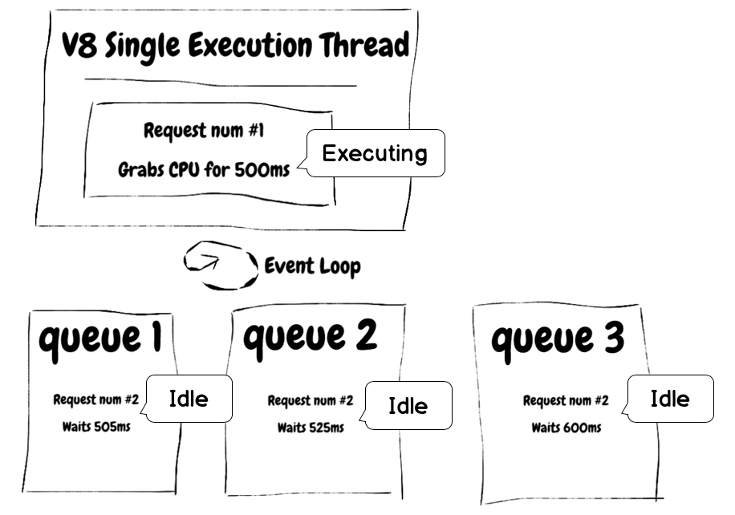

# Don't block the event loop

<br/><br/>

Node handles the Event Loop mostly on a single thread rotating through multiple queues. Operations with high complexity, large json parsing, applying logic over huge arrays, unsafe regex queries, and large IO operations are some of the operations that can cause the Event Loop to stall. Avoid this off-loading CPU intensive tasks to a dedicated service (e.g. job server), or breaking long tasks into small steps then using the Worker Pool are some examples of how to avoid blocking the Event Loop.

### Example: blocking the event loop
Let's take a look at an example from [Node Clinic](https://clinicjs.org/documentation/doctor/05-fixing-event-loop-problem).
```javascript
function sleep (ms) {
  const future = Date.now() + ms
  while (Date.now() < future);
}

server.get('/', (req, res, next) => {
  sleep(30)
  res.send({})
  next()
})
```

And when we benchmark this app, we start to see the latency caused by the long
while loop.

### Run the benchmark 
`clinic doctor --on-port 'autocannon localhost:$PORT' -- node slow-event-loop`

### The results

```
┌─────────┬────────┬────────┬────────┬────────┬───────────┬──────────┬───────────┐
│ Stat    │ 2.5%   │ 50%    │ 97.5%  │ 99%    │ Avg       │ Stdev    │ Max       │
├─────────┼────────┼────────┼────────┼────────┼───────────┼──────────┼───────────┤
│ Latency │ 270 ms │ 300 ms │ 328 ms │ 331 ms │ 300.56 ms │ 38.55 ms │ 577.05 ms │
└─────────┴────────┴────────┴────────┴────────┴───────────┴──────────┴───────────┘
┌───────────┬─────────┬─────────┬─────────┬────────┬─────────┬───────┬─────────┐
│ Stat      │ 1%      │ 2.5%    │ 50%     │ 97.5%  │ Avg     │ Stdev │ Min     │
├───────────┼─────────┼─────────┼─────────┼────────┼─────────┼───────┼─────────┤
│ Req/Sec   │ 31      │ 31      │ 33      │ 34     │ 32.71   │ 1.01  │ 31      │
├───────────┼─────────┼─────────┼─────────┼────────┼─────────┼───────┼─────────┤
```

## Image of the Event Loop



### "Here's a good rule of thumb for keeping your Node server speedy: _Node is fast when the work associated with each client at any given time is 'small'_."
From Node.js Documentation - [Don't Block the Event Loop (or the Worker Pool)](https://nodejs.org/en/docs/guides/dont-block-the-event-loop/)

> The secret to the scalability of Node.js is that it uses a small number of threads to handle many clients.
> If Node.js can make do with fewer threads, then it can spend more of your system's time and memory working on clients rather than on paying space and time overheads for threads (memory, context-switching).
> But because Node.js has only a few threads, you must structure your application to use them wisely.
> 
> Here's a good rule of thumb for keeping your Node.js server speedy: Node.js is fast when the work associated with each client at any given time is "small".
> This applies to callbacks on the Event Loop and tasks on the Worker Pool.

### "Most people fail their first few NodeJS apps merely due to the lack of understanding of the concepts such as the Event Loop, Error handling and asynchrony"
From Deepal's Blog - [Event Loop Best Practices — NodeJS Event Loop Part 5](https://blog.insiderattack.net/event-loop-best-practices-nodejs-event-loop-part-5-e29b2b50bfe2)

